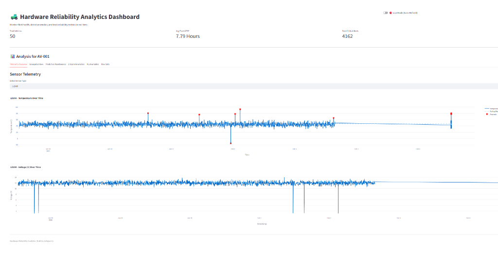
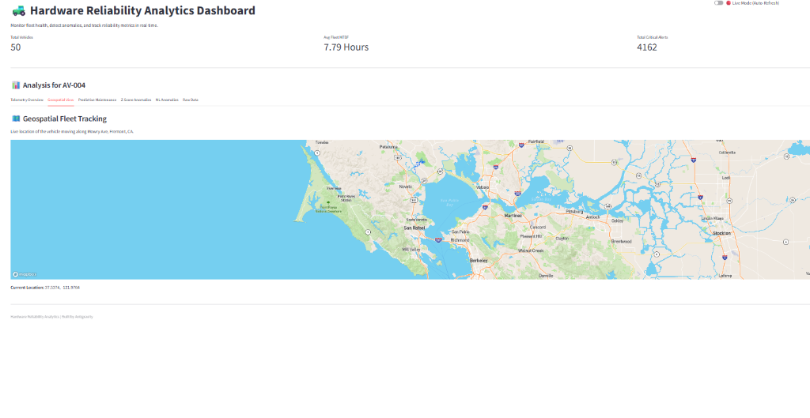
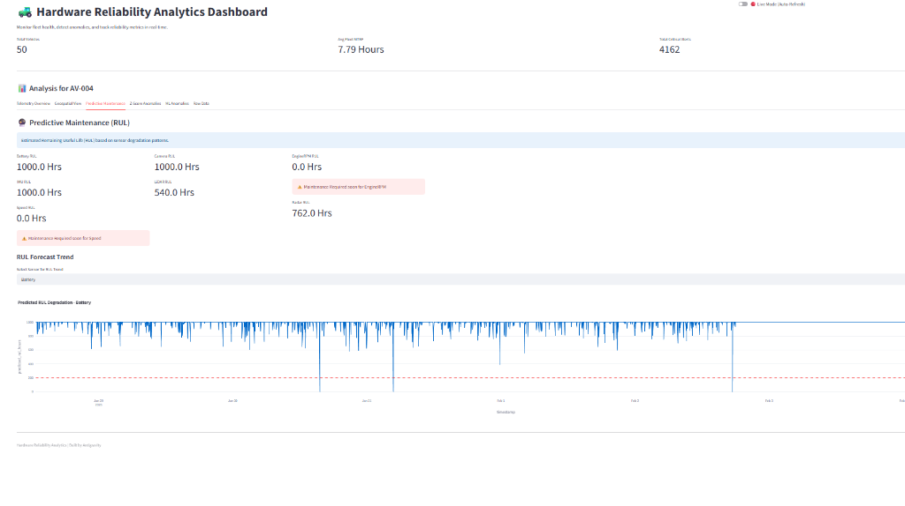
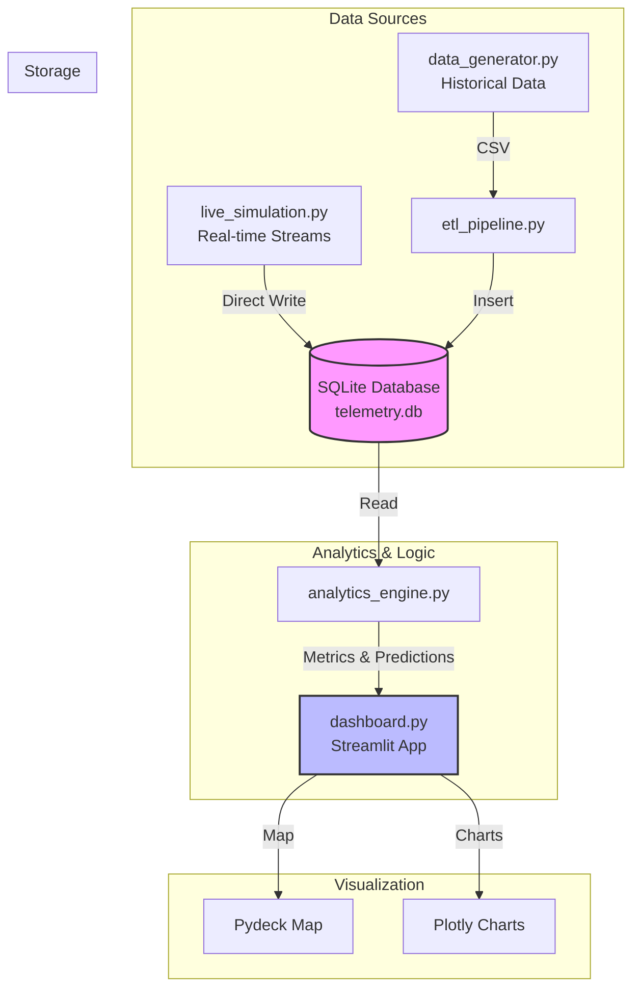

# ⚠️ Important Notice

**Do not push this project to a public GitHub repository.**

This project contains files (such as `.env`, local data, and credentials) that are protected by `.gitignore` but may still contain sensitive or private information. Always review your files and repository settings before sharing or publishing.


# Autonomous Fleet Reliability Intelligence Platform 🚜

## Project Purpose

This project was created as a hands-on learning platform to explore modern, real-time data engineering, analytics, and AI techniques in the context of autonomous vehicle fleet management. It is designed for anyone interested in building scalable, cloud-ready systems and understanding how streaming, analytics, and AI can be combined for actionable insights. The platform is ideal for:
- Learning distributed systems and event-driven architectures
- Experimenting with real-time analytics and anomaly detection
- Practicing full-stack development with modern tools
- Demonstrating end-to-end solutions for reliability and observability

---

## 🏗️ System Architecture

- **Frontend**: React, Tailwind CSS, Vite, Deck.gl (high-performance map rendering)
- **Backend API**: FastAPI, WebSockets
- **Streaming Layer**: Apache Kafka (KRaft mode)
- **Database**: PostgreSQL (or SQLite for local testing) via SQLAlchemy
- **ML & Analytics**: Isolation Forest, Z-Score Anomaly Detection, RUL Forecasting
- **AI Copilot**: LangChain + OpenAI RAG for root cause analysis

## 🚀 Getting Started (No Docker Required)

This project is designed to run locally on Windows using Python virtual environments and native Kafka binaries.

### Prerequisites
- Python 3.10+
- Node.js 18+ (for frontend)

### Quick Start
1. **Setup backend and Kafka:**
	```cmd
	cd infrastructure
	setup.bat
	```
2. **Install frontend dependencies:**
	```cmd
	cd ../frontend
	npm install
	cd ..
	```
3. **Start all services:**
	```cmd
	cd infrastructure
	start.bat
	```

### Access Points
- **Dashboard:** [http://localhost:5173](http://localhost:5173)
- **API Docs:** [http://localhost:8000/docs](http://localhost:8000/docs)
*(If on Linux/Mac, you'll need to install Kafka and run it manually, or adapt the shell commands)*


### Configuration
A `.env` file will be created in the root directory on first run:
- Keep `DATABASE_URL` as SQLite for quick start, or set to PostgreSQL for production.
- Add your `OPENAI_API_KEY` to enable the AI Copilot feature.

### Access Points
- **Dashboard**: [http://localhost:5173](http://localhost:5173)
- **API Swagger Docs**: [http://localhost:8000/docs](http://localhost:8000/docs)


## ✨ Key Features
- **Live WebSocket Streaming:** Real-time vehicle movement and chart updates
- **Root Cause Analysis Engine:** AI and heuristics distinguish between sensor anomalies (e.g., "Cooling Fan Failure" vs. "Power Fluctuation")
- **AI Fleet Copilot:** Ask questions like "Which vehicles are failing?" directly in the UI
- **Predictive Maintenance:** Forecast remaining useful life (RUL) for components
- **Modern, Modular Codebase:** Easily extend or adapt for new use cases

---

## 📸 Screenshots

Below are sample screenshots of the dashboard and analytics views you can expect from this project:

### Dashboard Overview


### Geospatial Fleet View


### Predictive Maintenance Analytics


---

## License
This project is for educational and demonstration purposes. Feel free to use, modify, and extend it for your own learning or prototyping needs.

=======
# Hardware Reliability Analytics for Autonomous Sensor Fleet 🚜

Hey there! 👋 Welcome to the **Hardware Reliability Analytics** project.

This is a dashboard I built to monitor the health and reliability of a fictional autonomous vehicle fleet. The idea was to create something that simulates real telemetry data (like LiDAR temps, battery voltage, etc.) and then uses that data to predict when parts might fail. **Note: All data in this project is synthetic and generated entirely using custom Python scripts to mimic real-world scenarios.**

It's running a simulation of vehicles driving around **Mowry Ave in Fremont, CA**, and you can track everything in real-time.


## What's Inside?

### 1. 🗺️ Live Fleet Tracking
I hooked up a geospatial view so you can see exactly where the vehicles are. They move in real-time if you run the simulation script.
- **Location**: Mowry Ave, Fremont, CA.
- **Tech**: I used Pydeck for the map because it handles street-level zooming way better than the standard map tools.


### 2. 🔮 Predictive Maintenance (RUL)
Instead of just waiting for things to break, I added a "Predictive Maintenance" tab.
- It calculates the **Remaining Useful Life (RUL)** for sensors.
- If a sensor drops below 200 hours of estimated life, it flags it so you can "fix" it before it fails.


### 3. 📊 The Data Stuff
- **Metrics**: Tracks Mean Time Between Failures (MTBF) and critical alerts.
- **Anomaly Detection**: I'm running two checks on the data:
    - Simple Z-Score (for obvious spikes).
    - Isolation Forest (Machine Learning) to catch the weird stuff that isn't just a simple spike.

## 🏗️ System Architecture

Here's how the data flows through the system:



## How to Run It

First, grab the dependencies:
```bash
pip install -r requirements.txt
```

### 1. Generate the Data only once
You need some data to start with. Run this to generate a week's worth of history and set up the database:
```bash
python data_generator.py
python etl_pipeline.py
```

### 2. Launch the Dashboard
This fires up the UI:
```bash
streamlit run dashboard.py
```

### 3. 🔴 Turning on Live Mode (The Cool Part)
If you want to see the blue dots move on the map:

1.  Open a **new terminal window**.
2.  Run the simulation script:
    ```bash
    python live_simulation.py
    ```
3.  Go back to your browser dashboard and toggle the **"Live Mode"** switch in the top right.
4.  Watch it go! 🚀


