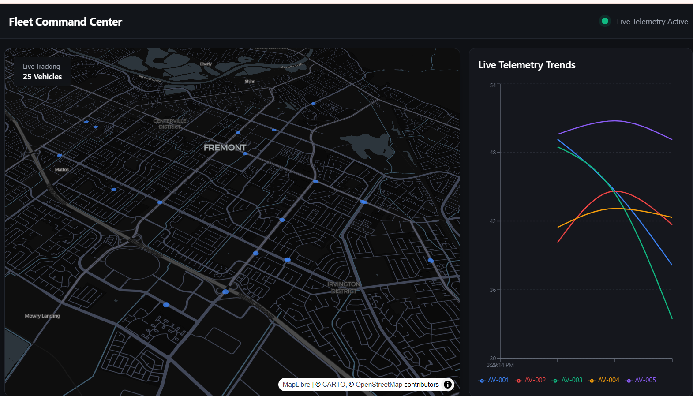
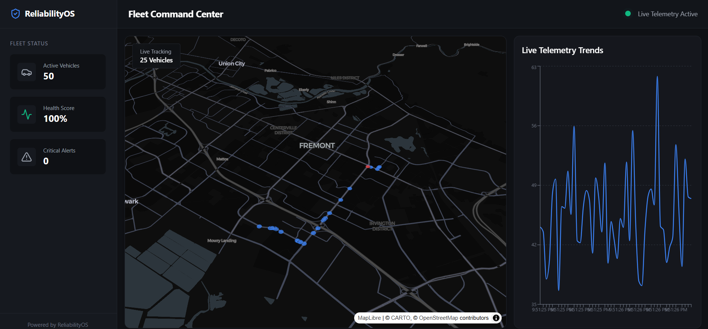
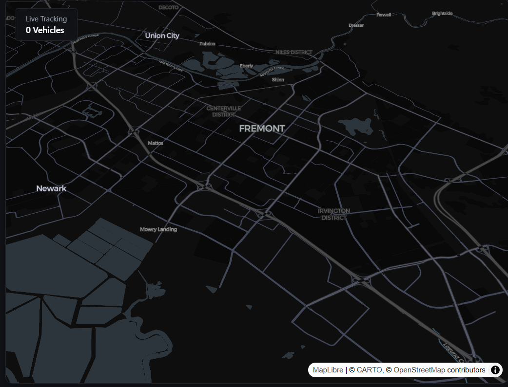
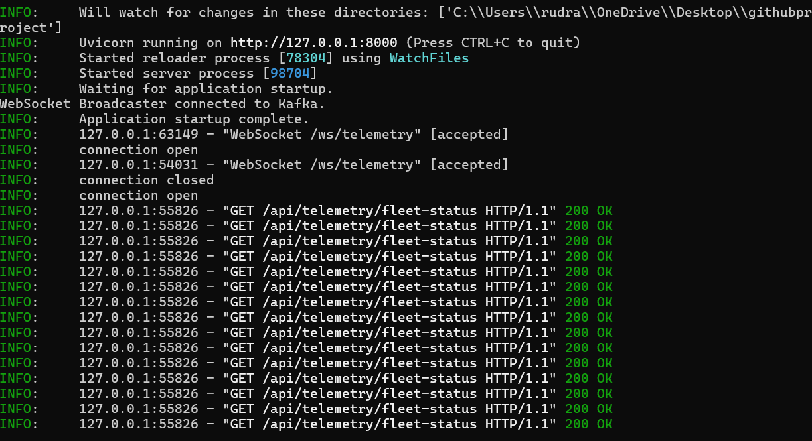

Autonomous Fleet Reliability Intelligence Platform 🚜

A real-time fleet intelligence platform designed for telemetry ingestion, anomaly detection, predictive maintenance, and AI-assisted operational analytics for autonomous and connected vehicle systems.

This platform can be used across multiple industries where large-scale telemetry, operational monitoring, and real-time decision-making are critical. It is highly applicable in autonomous vehicle fleets, logistics and transportation systems, industrial IoT environments, smart city infrastructure, manufacturing operations, warehouse robotics, defense systems, agricultural automation, and predictive maintenance platforms. Organizations can use it to monitor live vehicle movement, detect anomalies before failures occur, analyze operational efficiency, forecast component degradation, and build intelligent AI-assisted observability systems for mission-critical operations. The project also serves as a strong learning and prototyping environment for distributed systems, event-driven architectures, cloud-native analytics, AI-powered monitoring systems, and real-time operational intelligence.

This project simulates a production-grade telemetry ecosystem where live vehicle data is streamed, processed, analyzed, and visualized in real time using distributed systems and modern AI-powered analytics.

## ✨ Features
- Real-time telemetry streaming using Apache Kafka
- Live fleet tracking with WebSockets
- Interactive geospatial visualization using Deck.gl
- AI-assisted root cause analysis
- Predictive maintenance and Remaining Useful Life (RUL) forecasting
- Real-time anomaly detection using Isolation Forest and statistical models
- Modern operational dashboard with dark-mode UI
- Modular and scalable architecture
- Cloud-ready deployment structure
- AI-powered fleet intelligence workflows

## 📸 Dashboard Preview

### Dashboard Previews

**Fleet Command Center**

**Alternate Dashboard View**

**Live Map Visualization**

**System Log Analytics**

These dashboards provide a real-time overview of your autonomous fleet operations, including:
- Live vehicle tracking on an interactive map
- Telemetry trends for multiple vehicles
- Anomaly and health analytics
- Modern, dark-mode UI for command center environments

The dashboard provides:

- Live telemetry tracking
- Real-time fleet monitoring
- Vehicle health analytics
- Interactive operational maps
- Streaming telemetry trends
- Fleet-wide anomaly visualization
- High-performance geospatial rendering
🏗️ System Architecture
Autonomous Vehicles / IoT Sensors
                │
                ▼
        Apache Kafka Streams
                │
                ▼
      FastAPI Backend Services
                │
 ┌──────────────┼──────────────┐
 ▼              ▼              ▼
Telemetry   ML Analytics   WebSocket Hub
 Storage     Engine
                │
                ▼
      React + Deck.gl Dashboard
                │
                ▼
      AI Fleet Copilot / RAG
🧠 AI & Analytics Engine

The analytics engine continuously evaluates incoming telemetry streams to identify operational risks, predict failures, and provide actionable insights in real time.

Live Telemetry Infrastructure

FastAPI and WebSocket backend infrastructure processing real-time telemetry events, fleet synchronization, and streaming analytics workflows.

Real-Time Fleet Tracking

Interactive geospatial visualization powered by Deck.gl and MapLibre for live fleet movement simulation and operational intelligence monitoring.

## Included Analytics Modules
- Isolation Forest anomaly detection
- Z-Score based anomaly scoring
- Predictive maintenance forecasting
- Fleet health scoring
- Telemetry trend analysis
- Root cause inference engine
- Operational intelligence workflows

## Example Detections
- Cooling system degradation
- Sensor instability
- Voltage fluctuations
- Power delivery failures
- Fleet-wide anomaly patterns
- Route-level operational irregularities
## ⚡ Technology Stack

**Frontend:**
- React
- Vite
- Tailwind CSS
- Deck.gl
- MapLibre GL

**Backend:**
- FastAPI
- WebSockets
- SQLAlchemy

**Streaming & Infrastructure:**
- Apache Kafka (KRaft Mode)
- PostgreSQL / SQLite
- Docker-ready architecture

**AI / Machine Learning:**
- Scikit-learn
- Isolation Forest
- LangChain
- OpenAI API Integration
🚀 Real-Time Capabilities

The platform supports:

High-frequency telemetry ingestion
Live vehicle movement simulation
Real-time anomaly alerts
Streaming operational analytics
Interactive fleet visualization
AI-assisted diagnostics

Vehicle telemetry data is continuously streamed through Kafka topics and broadcast to connected dashboard clients through WebSockets with low-latency updates.

📂 Project Structure
backend/          → FastAPI services and APIs
frontend/         → React dashboard UI
streaming/        → Kafka producers and consumers
ml/               → AI and analytics models
infrastructure/   → Kafka setup and startup scripts
assets/           → Images and architecture diagrams
🚀 Getting Started
Prerequisites
Python 3.10+
Node.js 18+
Apache Kafka
Git
🔧 Installation
1. Clone the Repository
git clone <your-repository-url>
cd telemetry-project
2. Setup Backend & Kafka
cd infrastructure
setup.bat
3. Install Frontend Dependencies
cd ../frontend
npm install
4. Start All Services
cd ../infrastructure
start.bat
🌐 Access Points
Service	URL
Dashboard	http://localhost:5173

FastAPI Docs	http://localhost:8000/docs

WebSocket Endpoint	ws://localhost:8000/ws/telemetry
🔴 Live Simulation

To activate live fleet simulation:

Open a new terminal window and run:

python live_simulation.py

Then enable Live Mode from the dashboard UI.

📊 Example Use Cases
Fleet Management

Monitor vehicle health, operational telemetry, and route intelligence in real time.

Predictive Maintenance

Forecast component failures before operational breakdowns occur.

Smart City Infrastructure

Analyze distributed transportation telemetry streams and operational behavior.

Industrial IoT

Track machine telemetry and detect operational anomalies across industrial systems.

Autonomous Systems Research

Experiment with distributed systems, AI analytics, and real-time telemetry pipelines.

Warehouse Robotics

Monitor robotic fleets, battery health, and operational reliability.

🔮 Future Improvements
Multi-region fleet simulation
Historical route replay
Driver behavior analytics
Alert prioritization engine
Reinforcement learning-based optimization
Kubernetes deployment
Edge telemetry processing
AI-generated operational reports
Distributed microservice orchestration
📈 Why This Project Matters

Modern autonomous and connected systems generate massive volumes of telemetry data that require real-time processing, intelligent anomaly detection, and operational observability.

This platform demonstrates how distributed streaming systems, machine learning models, AI copilots, and modern visualization frameworks can work together to build scalable fleet intelligence infrastructure for real-world operational environments.

