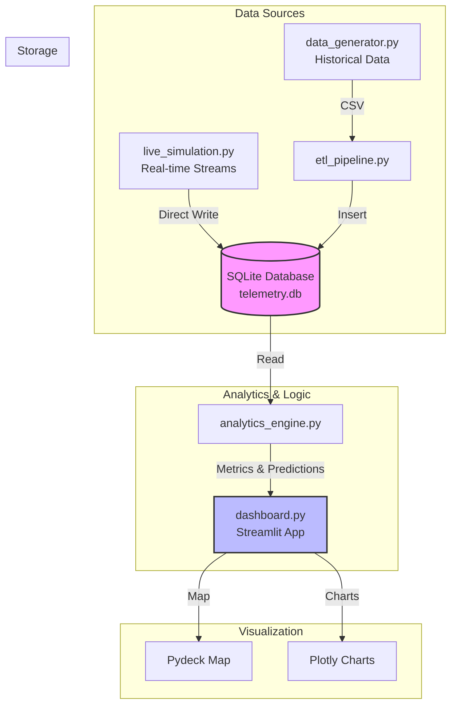

# Hardware Reliability Analytics for Autonomous Sensor Fleet 🚜

Hey there! 👋 Welcome to the **Hardware Reliability Analytics** project.

This is a dashboard I built to monitor the health and reliability of a fictional autonomous vehicle fleet. The idea was to create something that simulates real telemetry data (like LiDAR temps, battery voltage, etc.) and then uses that data to predict when parts might fail. **Note: All data in this project is synthetic and generated entirely using custom Python scripts to mimic real-world scenarios.**

It's running a simulation of vehicles driving around **Mowry Ave in Fremont, CA**, and you can track everything in real-time.


## What's Inside?

### 1. 🗺️ Live Fleet Tracking
I hooked up a geospatial view so you can see exactly where the vehicles are. They move in real-time if you run the simulation script.
- **Location**: Mowry Ave, Fremont, CA.
- **Tech**: I used Pydeck for the map because it handles street-level zooming way better than the standard map tools.


### 2. 🔮 Predictive Maintenance (RUL)
Instead of just waiting for things to break, I added a "Predictive Maintenance" tab.
- It calculates the **Remaining Useful Life (RUL)** for sensors.
- If a sensor drops below 200 hours of estimated life, it flags it so you can "fix" it before it fails.


### 3. 📊 The Data Stuff
- **Metrics**: Tracks Mean Time Between Failures (MTBF) and critical alerts.
- **Anomaly Detection**: I'm running two checks on the data:
    - Simple Z-Score (for obvious spikes).
    - Isolation Forest (Machine Learning) to catch the weird stuff that isn't just a simple spike.

## 🏗️ System Architecture

Here's how the data flows through the system:



## How to Run It

First, grab the dependencies:
```bash
pip install -r requirements.txt
```

### 1. Generate the Data only once
You need some data to start with. Run this to generate a week's worth of history and set up the database:
```bash
python data_generator.py
python etl_pipeline.py
```

### 2. Launch the Dashboard
This fires up the UI:
```bash
streamlit run dashboard.py
```

### 3. 🔴 Turning on Live Mode (The Cool Part)
If you want to see the blue dots move on the map:

1.  Open a **new terminal window**.
2.  Run the simulation script:
    ```bash
    python live_simulation.py
    ```
3.  Go back to your browser dashboard and toggle the **"Live Mode"** switch in the top right.
4.  Watch it go! 🚀

---
*Built for the Telemetry Project.*
